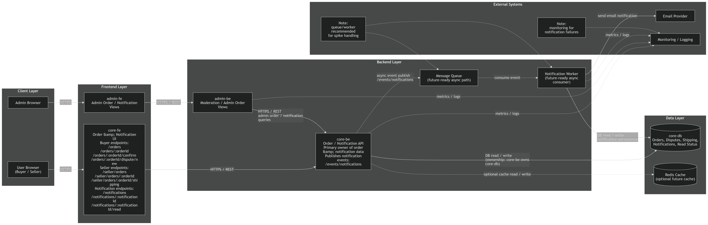
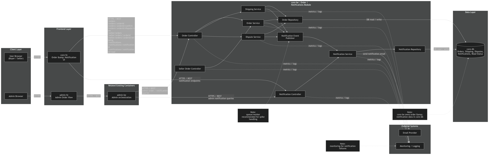
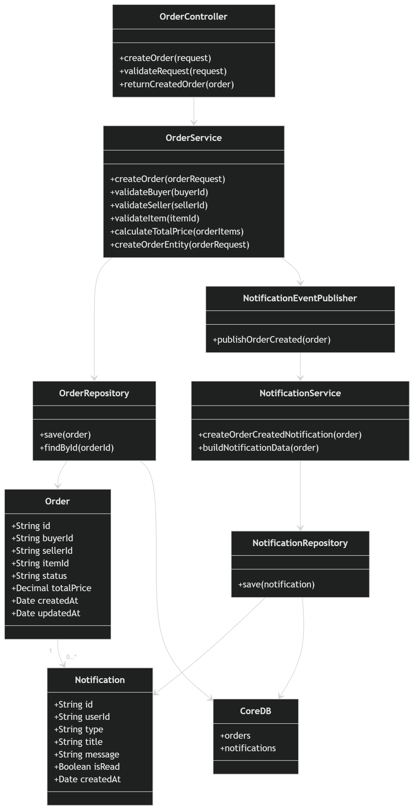
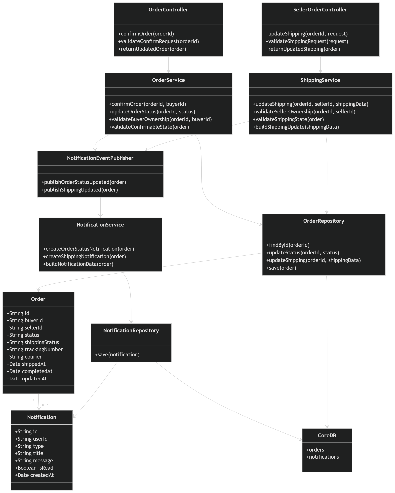
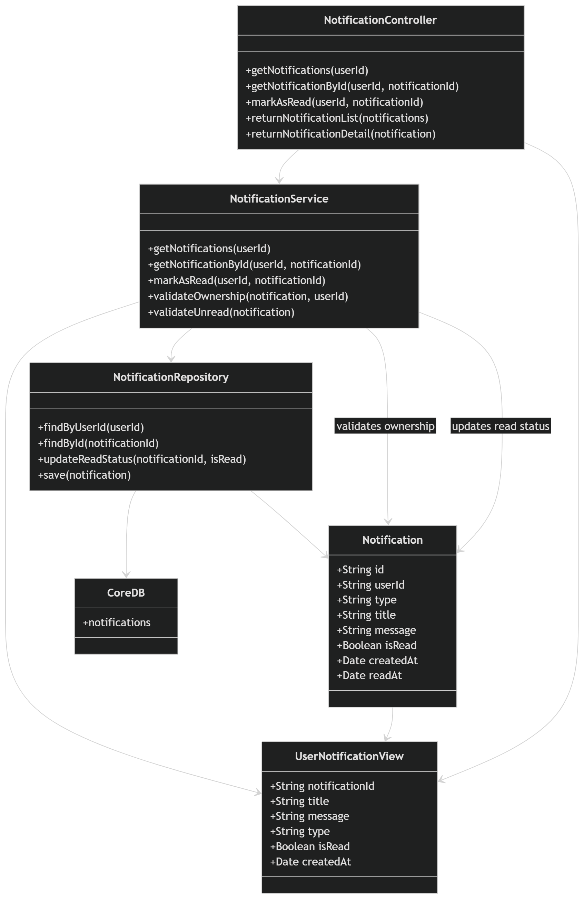
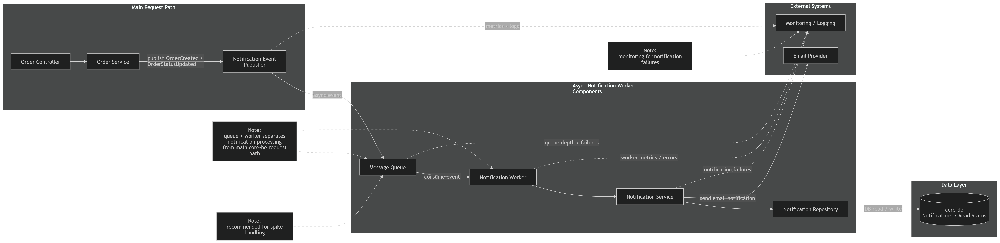
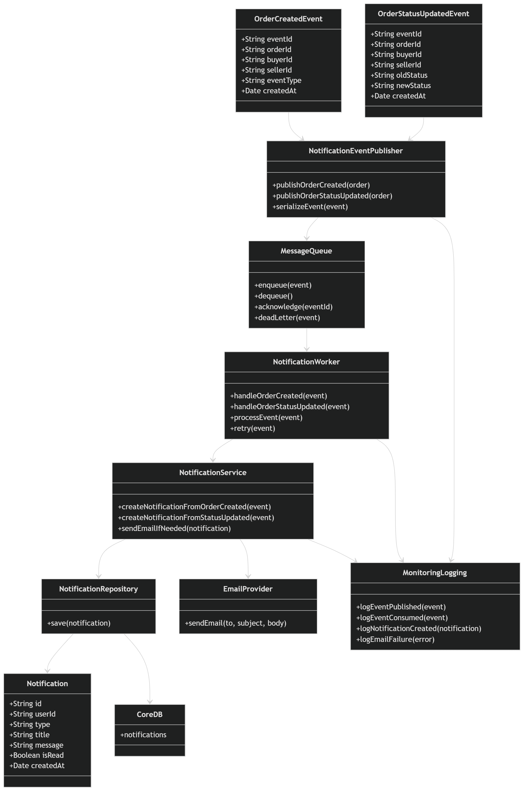

---

## 4. Arsitektur Individual - Edward Jeremy Worang

Bagian arsitektur individual ini memperluas modul **Order dan Notifications** pada BidMart. Berdasarkan container diagram kelompok, modul Order dan Notifications terutama berada di dalam container `core-be` karena data order, shipping, dispute, dan notification merupakan bagian dari domain marketplace dan disimpan di `core-db`.

Diagram-diagram berikut menjelaskan fokus container individual, struktur komponen internal, dan alur kode yang berkaitan dengan modul yang saya kerjakan.

---

### 4.1 Individual Container Diagram - Order dan Notifications

Individual container diagram ini berfokus pada container yang berkaitan langsung dengan modul Order dan Notifications.

Container utama pada modul ini adalah `core-be`, yang menangani endpoint order untuk buyer, endpoint order untuk seller, endpoint notification, serta event publishing untuk notification. `core-fe` berkomunikasi dengan `core-be` melalui HTTPS/REST, sedangkan `admin-fe` berkomunikasi dengan `admin-be` untuk kebutuhan admin order dan notification views.

Container `core-be` memiliki ownership terhadap `core-db`, yang menyimpan data order dan notification. Hal ini mengikuti aturan arsitektur kelompok bahwa `core-be` adalah satu-satunya backend service yang boleh mengakses `core-db` secara langsung. Diagram ini juga menunjukkan komponen pendukung masa depan seperti Redis cache, message queue, notification worker, email provider, dan monitoring/logging.

---

### 4.2 Component Diagram - Order dan Notifications di dalam `core-be`

Component diagram ini memperluas container `core-be` menjadi komponen-komponen internal yang berkaitan dengan Order dan Notifications.

Komponen utama yang ditampilkan adalah:

- **Order Controller**: Menangani endpoint order untuk buyer seperti `/orders`, `/orders/:orderId`, `/orders/:orderId/confirm`, dan `/orders/:orderId/dispute/new`.
- **Seller Order Controller**: Menangani endpoint order untuk seller seperti `/seller/orders`, `/seller/orders/:orderId`, dan `/seller/orders/:orderId/shipping`.
- **Notification Controller**: Menangani endpoint notification seperti `/notifications`, `/notifications/:notificationId`, dan `/notifications/:notificationId/read`.
- **Order Service**: Berisi business logic order, seperti membuat order, memvalidasi state order, dan memperbarui status order.
- **Shipping Service**: Menangani pembaruan order yang berkaitan dengan shipping.
- **Dispute Service**: Menangani pembuatan dispute pada order.
- **Notification Service**: Membuat dan mengelola notification.
- **Notification Event Publisher**: Mempublikasikan event notification setelah terjadi perubahan pada order.
- **Order Repository**: Membaca dan menulis data order ke `core-db`.
- **Notification Repository**: Membaca dan menulis data notification ke `core-db`.

Component diagram ini konsisten dengan container diagram kelompok karena seluruh operasi order dan notification tetap berada dalam batas ownership `core-be -> core-db`.

---

### 4.3 Code Diagram 1 - Create Order Flow

Code diagram ini menunjukkan bagaimana endpoint `/orders` diproses.

Alur dimulai ketika buyer mengirim request pembuatan order dari `core-fe`. Request tersebut dikirim ke **Order Controller**, lalu diteruskan ke **Order Service**. Service melakukan validasi data order dan menggunakan **Order Repository** untuk menyimpan order baru ke dalam `core-db`.

Setelah order berhasil dibuat, sistem juga memicu pembuatan notification melalui **Notification Event Publisher** dan **Notification Service**. Notification kemudian disimpan melalui **Notification Repository** ke dalam `core-db`.

Alur ini menunjukkan bahwa proses pembuatan order dan pembuatan notification saling terhubung, tetapi keduanya tetap berada di dalam batas modul `core-be`.

---

### 4.4 Code Diagram 2 - Update Shipping / Order Status Flow

Code diagram ini menunjukkan bagaimana perubahan status order diproses melalui endpoint seperti `/seller/orders/:orderId/shipping` dan `/orders/:orderId/confirm`.

Untuk update shipping oleh seller, seller mengirim request dari `core-fe` ke **Order Controller**. Request tersebut diproses oleh **Order Service**, yang kemudian memeriksa data order melalui **Order Repository**. Jika seller memiliki otorisasi dan state order valid, status order diperbarui di `core-db`.

Untuk konfirmasi order oleh buyer, buyer mengonfirmasi bahwa order sudah diterima. Service memvalidasi bahwa buyer merupakan pemilik order dan order berada pada state yang dapat dikonfirmasi. Setelah status order diperbarui, notification event dipicu agar user terkait dapat menerima informasi perubahan order.

Diagram ini menunjukkan bagaimana modul menjaga konsistensi state order sekaligus memicu notification setelah terjadi perubahan penting pada order.

---

### 4.5 Code Diagram 3 - Notification Read / Mark as Read Flow

Code diagram ini menunjukkan bagaimana retrieval notification dan update read status diproses.

Untuk endpoint `/notifications`, **Notification Controller** memanggil **Notification Service**, yang mengambil daftar notification milik user dari `core-db` melalui **Notification Repository**.

Untuk endpoint `/notifications/:notificationId`, service mengambil notification tertentu dan memvalidasi bahwa notification tersebut memang milik user yang sedang login.

Untuk endpoint `/notifications/:notificationId/read`, service memvalidasi ownership notification dan memperbarui read status notification di `core-db`.

Alur ini memastikan bahwa user hanya dapat mengakses dan memperbarui notification miliknya sendiri.

---

## Bonus - Async Notification Worker

### Bonus Component Diagram - Async Notification Worker

Bonus component diagram ini menunjukkan improvement masa depan, yaitu memisahkan proses notification dari main request path.

Daripada memproses notification langsung di dalam alur request order, **Order Service** dapat mempublikasikan event melalui **Notification Event Publisher**. Event tersebut dimasukkan ke dalam **Message Queue**, lalu dikonsumsi oleh **Notification Worker**. Worker kemudian memanggil **Notification Service**, yang menyimpan data notification dan mengirim email notification jika diperlukan.

Desain ini berguna ketika BidMart menerima traffic tinggi, terutama saat terjadi spike pada aktivitas auction atau marketplace. Pemrosesan notification dapat diskalakan secara terpisah dengan menambahkan lebih banyak worker.

---

### Bonus Code Diagram - Async Notification Event Flow

Bonus code diagram ini menunjukkan alur notification berbasis event-driven.

Request order diproses terlebih dahulu melalui alur order normal. Setelah order disimpan atau diperbarui, **Order Service** mempublikasikan event `OrderCreated` atau `OrderStatusUpdated`. Event tersebut dimasukkan ke dalam queue, dan main request dapat segera mengembalikan response kepada user tanpa harus menunggu proses delivery notification selesai.

Setelah itu, **Notification Worker** mengonsumsi event tersebut, membuat notification melalui **Notification Service**, menyimpannya ke `core-db`, dan mengirim email melalui **Email Provider** jika diperlukan. Jika pengiriman email gagal, failure tersebut dapat dicatat melalui monitoring dan ditangani menggunakan retry atau dead-letter queue.

Pendekatan ini meningkatkan scalability karena proses notification delivery yang lambat tidak memblokir request utama order.