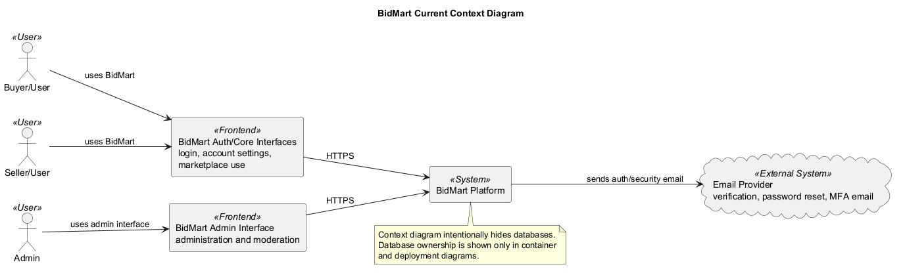
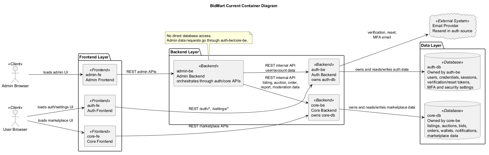
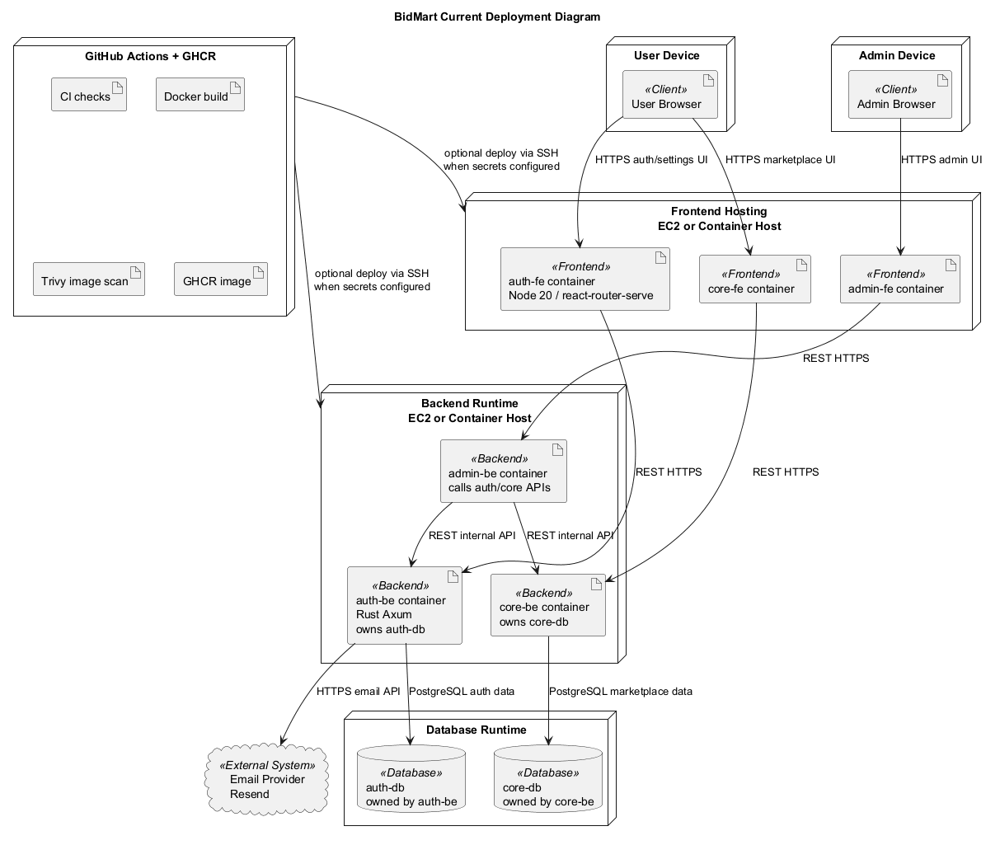
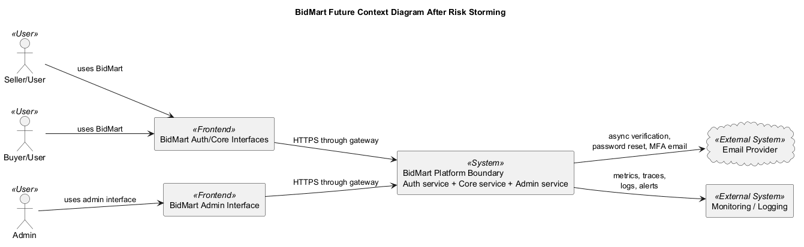
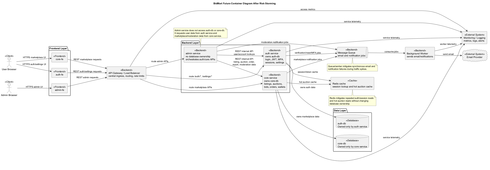
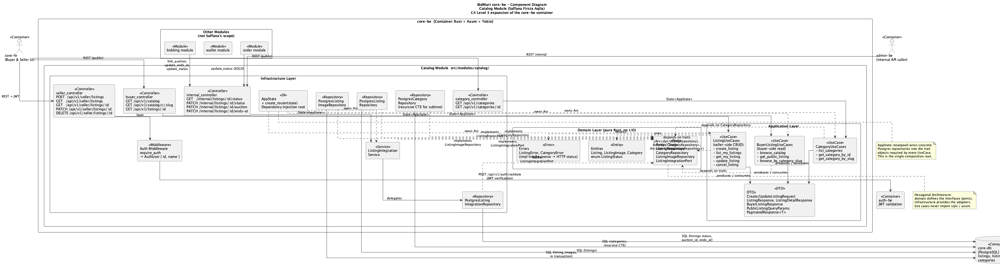
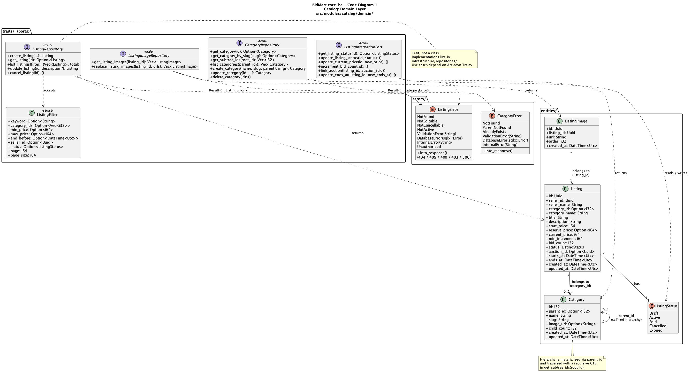
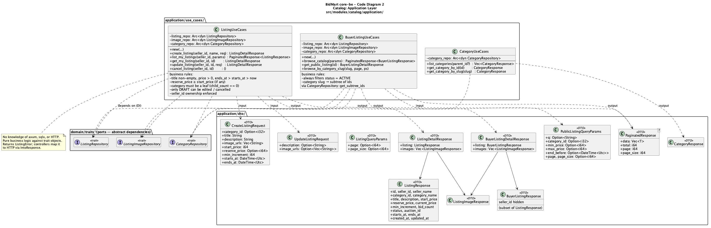
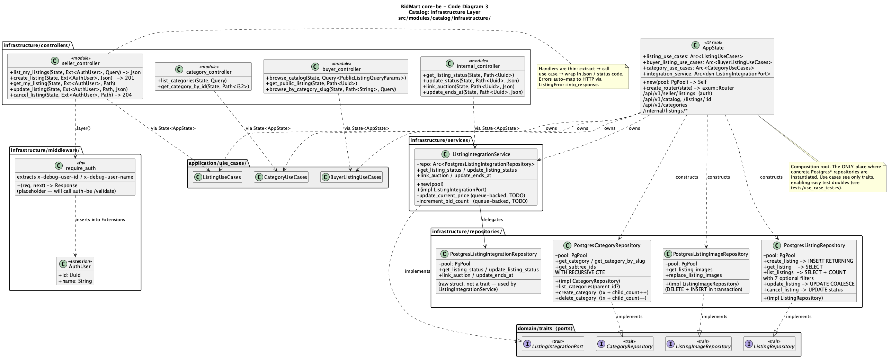

# BidMart - Group A10

## 1. Current Architecture - Context, Container, and Deployment Diagram

### System Context Diagram

System Context Diagram ini memberikan gambaran ekosistem platform BidMart sebagai
sistem marketplace dan lelang real-time.

Diagram ini sengaja dibuat high-level. Aktor pengguna berinteraksi melalui
interface BidMart, administrator berinteraksi melalui admin interface, dan sistem
bergantung pada layanan eksternal untuk pengiriman email verifikasi, reset
password, dan MFA.

Diagram konteks tidak menampilkan database karena detail kepemilikan data berada
pada container dan deployment diagram.

**Aktor dan sistem eksternal yang terlibat:**

- **Buyer/User**: Pengguna yang melakukan autentikasi, mengakses marketplace,
  mengikuti lelang, membuat bid, dan mengelola transaksi.
- **Seller/User**: Pengguna yang melakukan autentikasi, membuat listing,
  mengelola barang, dan memproses pesanan.
- **Admin**: Pengguna internal yang mengakses admin interface untuk moderasi,
  laporan, dan operasi platform.
- **Email Provider**: Sistem eksternal yang digunakan oleh auth service untuk
  email verification, password reset, dan MFA email.

---

### Container Diagram

BidMart menggunakan arsitektur multi-container yang memisahkan frontend, backend,
dan kepemilikan database berdasarkan batas layanan.

Relasi antarkomponen dibuat eksplisit untuk mencegah coupling yang salah:

- `auth-fe` hanya memanggil `auth-be`.
- `core-fe` hanya memanggil `core-be`.
- `admin-fe` hanya memanggil `admin-be`.

**Container yang ada:**

- **auth-fe**: Frontend untuk autentikasi dan account/settings UI. Container ini
  hanya memanggil `auth-be`.
- **core-fe**: Frontend untuk marketplace, listing, auction, bid, order, wallet,
  dan fitur core lain. Container ini hanya memanggil `core-be`.
- **admin-fe**: Frontend untuk admin/moderation UI. Container ini hanya memanggil
  `admin-be`.
- **auth-be**: Backend autentikasi. Service ini memiliki `auth-db` dan menangani
  users, credentials, sessions, verification tokens, password reset tokens, MFA
  data, dan security settings.
- **core-be**: Backend marketplace. Service ini memiliki `core-db` dan menangani
  listings, auctions, bids, orders, wallets, notifications, dan marketplace data.
- **admin-be**: Backend admin. Service ini tidak memiliki akses database langsung.
  Untuk user/account data, `admin-be` memanggil `auth-be`. Untuk listing,
  auction, order, report, atau moderation data, `admin-be` memanggil `core-be`.
- **auth-db**: Database milik `auth-be`.
- **core-db**: Database milik `core-be`.
- **Email Provider**: Layanan eksternal untuk email verification, reset password,
  dan MFA email.

**Aturan kepemilikan data:**

- `auth-be -> auth-db` adalah satu-satunya akses langsung ke `auth-db`.
- `core-be -> core-db` adalah satu-satunya akses langsung ke `core-db`.
- `admin-be` tidak boleh mengakses `auth-db` atau `core-db` secara langsung.
- Tidak ada akses silang seperti `auth-be -> core-db` atau `core-be -> auth-db`.

---

### Deployment Diagram

Deployment Diagram menunjukkan bagaimana container dijalankan pada runtime
environment dan tetap mempertahankan aturan dependency yang sama dengan container
diagram.

Browser pengguna mengakses auth/core frontend, browser admin mengakses admin
frontend, dan setiap frontend memanggil backend pasangannya. `admin-be`
melakukan orchestration melalui API `auth-be` dan `core-be`, bukan melalui
database.

**Deployment utama:**

- **User Device**: Menjalankan user browser untuk auth/settings dan marketplace
  UI.
- **Admin Device**: Menjalankan admin browser untuk admin UI.
- **Frontend Hosting / Container Host**: Menjalankan `auth-fe`, `core-fe`, dan
  `admin-fe`.
- **Backend Runtime / Container Host**: Menjalankan `auth-be`, `core-be`, dan
  `admin-be`.
- **Database Runtime**: Menyediakan dua database, yaitu `auth-db` dan `core-db`.
- **GitHub Actions + GHCR**: CI/CD, Docker build, image scan, dan image registry.
- **Email Provider**: Dipanggil oleh `auth-be` untuk kebutuhan auth/security
  email.

---

## 2. Future Architecture - After Risk Storming

Future architecture mempertahankan batas kepemilikan data yang sama, tetapi
menambahkan komponen yang secara langsung mengurangi risiko ketika trafik
BidMart meningkat.

Perubahan utama bukan menambah akses database, melainkan memperjelas routing,
ownership, observability, dan pemrosesan asynchronous.

### Future Context Diagram

Pada future context, pengguna dan admin tetap mengakses BidMart melalui interface
yang berbeda. Platform boundary menjadi lebih eksplisit karena ada gateway,
service boundary yang jelas, dan monitoring/logging untuk mendeteksi masalah
operasional ketika traffic naik.

Email provider tetap menjadi dependency eksternal untuk proses verification,
password reset, MFA, dan notifikasi yang relevan.

### Future Container Diagram

**Perubahan arsitektur masa depan:**

- **API Gateway / Load Balancer**: Mengatur ingress, routing, rate limiting, dan
  membantu mitigasi traffic spike.
- **Auth Service**: Tetap memiliki hanya `auth-db`.
- **Core Service**: Tetap memiliki hanya `core-db`.
- **Admin Service**: Tetap tidak memiliki database langsung dan melakukan
  orchestration melalui API auth/core.
- **Redis Cache**: Digunakan untuk session/token lookup dan hot auction cache
  tanpa mengubah kepemilikan database.
- **Message Queue + Background Worker**: Memindahkan pekerjaan email dan
  notification dari request path utama agar sistem lebih tahan terhadap latency
  provider eksternal.
- **Monitoring / Logging**: Memberi visibility terhadap error rate, latency,
  throughput, dan bottleneck tiap service.

---

## 3. Explanation of Risk Storming

Risk storming diterapkan karena BidMart berpotensi mengalami risiko arsitektural
ketika sukses dan menerima traffic tinggi, terutama saat auction berjalan
real-time.

Risiko terbesar bukan hanya performa, tetapi juga batas kepemilikan service yang
kabur. Jika `admin-be` mengakses `auth-db` dan `core-db` secara langsung, admin
backend akan menjadi tightly coupled dengan skema database service lain.
Akibatnya, perubahan schema auth atau core bisa merusak admin, business rules
bisa terduplikasi atau terlewati, audit keamanan menjadi lebih sulit, dan
scaling antarservice menjadi lebih berisiko.

Risiko lain yang ditemukan adalah authentication/session bottleneck, database
contention saat auction ramai, kegagalan pengiriman email/MFA, kurangnya
observability, dan deployment rollback risk. Pada arsitektur yang salah, service
dapat saling bergantung melalui shared database access. Pola ini membuat
ownership tidak jelas: auth data, marketplace data, dan admin operation terlihat
menyatu padahal seharusnya dipisahkan oleh API contract.

Future architecture memperbaiki risiko tersebut dengan menegakkan ownership:
auth service hanya mengakses `auth-db`, core service hanya mengakses `core-db`,
dan admin service hanya memanggil auth/core melalui REST/internal API. Auth data
tetap terisolasi, marketplace data tetap terisolasi, dan admin operation menjadi
orchestration layer, bukan pemilik data.

Gateway/load balancer, cache, queue, worker, dan monitoring ditambahkan hanya
karena masing-masing memiliki mitigasi risiko yang jelas: mengurangi bottleneck
ingress, mengurangi read pressure, menghindari blocking pada email/notification,
dan membuat failure lebih mudah dideteksi.

---

## Validation Notes

- Diagram ini hanya menggunakan dua database: `auth-db` dan `core-db`.
- Tidak ada panah `admin-be -> auth-db`.
- Tidak ada panah `admin-be -> core-db`.
- Tidak ada panah `auth-be -> core-db`.
- Tidak ada panah `core-be -> auth-db`.
- Tidak ada panah `admin-fe -> auth-be` atau `admin-fe -> core-be`.

---

## 4. Individual Component & Code Diagram – Saffana Firsta Aqila (2406440023)

### Component Diagram – `core-be` zoom-in ke Catalog Module
Diagram ini memperluas container `core-be` dari [Container Diagram](#container-diagram) grup ke komponen-komponen internal modul Catalog.

### Code Diagram 1 – Domain Layer

### Code Diagram 2 – Application Layer
Business rule yang ditegakkan di sini, antara lain: hanya status `DRAFT` yang boleh diedit/dibatalkan, kepemilikan `seller_id` selalu dicek, kategori harus berupa **leaf** (`child_count == 0`), dan buyer hanya melihat listing `ACTIVE`.

### Code Diagram 3 – Infrastructure Layer

